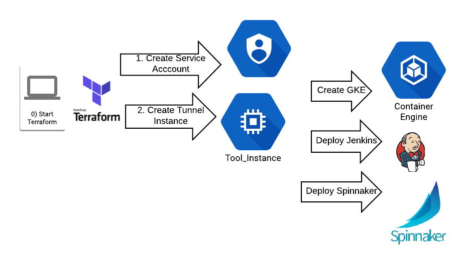

# CAPSTAN
Tools for creating Spinnaker demo environments

What is a [Capstan?](https://en.wikipedia.org/wiki/Capstan_(nautical)) .... That big rope...it is a Halyard - ZING!

if you are here you are interested in:
- Using Kubernettes
- Using Spinnaker
- Using Jenkins
- Not wanting to figure out how to set all that up yourself on some IaaS
- Just want to deploy containerized apps without all the fuss of doing all that set-up

Oh, we have a solution for you!

## Google Cloud Platform

This Demo environment creates a CD environment where Spinnaker and Jenkins are running within a GKE cluster.

The process is illustrated as follows:

Essentially, from your workstation you are using TerraForm to create a service account and to launch and instance that will run a script landed by terraform to perform the creation of the GKE platform, jenkins, and Spinnaker. Future versions will also use *declarative pipelines*

### Prerequisites

1. Do you have a computer (Mac Preferred)
1. Do you have a GCP project for this?
1. Do you have [Terraform](https://www.terraform.io/) Installed?
1. Do you have [Git](https://git-scm.com/book/en/v2/Getting-Started-Installing-Git) installed?
1. Do you have [GCLOUD SDK](https://cloud.google.com/sdk/downloads) installed?

That's it

### Procedure
1. Make sure you have followed the validation process described [here](./gcp/README.md)
1. git clone this repo (fork from your own if you like)
1. cd to the `gcp\terraform`
   1. optionally edit values in `env.sh`
1. Execute `terraform apply`
1. Go to the bathroom / lunch / another meeting
1. Hope for the best

When this is done you will create an SSH tunnel to Spinnaker. More details of this process is documted [here](./gcp/README.md)

## Amazon Web Services

1. I will throw our good friend @jpancoast-kenzan under the bus at https://github.com/kenzanlabs/spinnaker-terraform
1. Otherwise waiting on EKS life everyone else

## See Also

1. [Continious Delivery with Spinnaker and Kubernetes](http://continuousdelivery.kenzan.com/)

