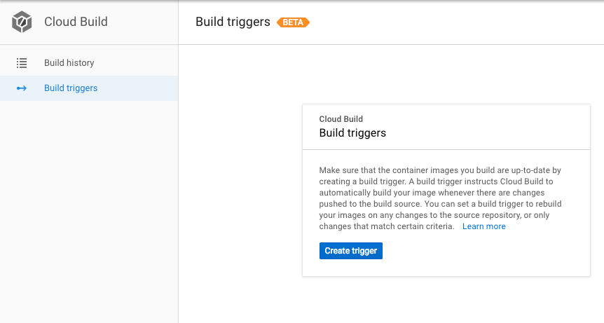
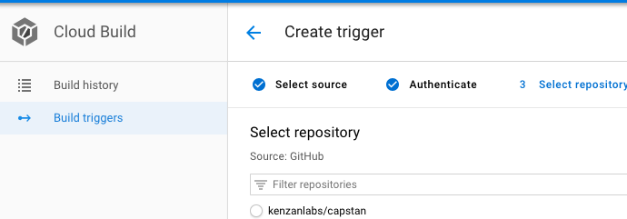
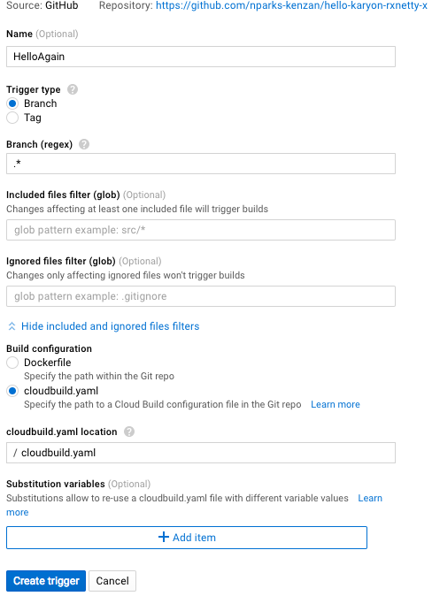

# Google Pub Sub with AutoScaling

This pipeline demonstrates

1. Google [Cloud Build](https://cloud.google.com/cloud-build/)
1. Google [Pub Sub](https://cloud.google.com/pubsub/) Trigger from Google Container [Registry](https://cloud.google.com/container-registry/) that Triggers a Spinnaker Pipeline Deployment
1. You will fork this [GitHub Repo](https://github.com/kenzanlabs/hello-karyon-rxnetty) as our *HelloAgain* app.
1. Kubernetes Pod AutoScaling (just for fun)

It is assumed that you have a GitHub account and are familiar with using git

## Setup Procedure

To execute this scenario you will
1. Configure a Build Trigger
1. Deploy a Pipeline
1. Configure Pipeline Trigger

Let's Begin!

### Configure Cloud Build

You should already have a fork of our *HelloAgain* app we are using. 

1. Make Sure you are signed into Github in the same browser as GCP
1. Access the GCP console and locate Cloud Build menu
1. Access build triggers

1. Select GitHub
1. GCP (if you are already signed into Github) will attempt an SSO and pull the repos that you own. Repo(s) you have access to but do not own will be greyed out

1. Configure Your New Trigger, make sure you select `cloudbuild.yaml`. 

1. Attempt to run your trigger
*Depending on the Vintage of your GCP project you might get a permission issue. 
Disable the Cloud Build API...wait some time (seriously)...and enable the api* 
1. Navigate to the Container Registry in the GCP console and make sure you see a new repository named `hello-karyon-rxnetty`

You will deploy this image

### Deploy Pipeline 

On the tools instance this readme and folder exist in a `pipelines folder`

On the tools instance navigate to this folder and execute

- `chmod +x sedprojectname.sh`
- ` ./sedprojectname.sh` :this will update the pipeline definition with your Google Project ID
- `spin pipeline save --file=dev-pipeline.json`: deploys new pipeline

This will add a new pipeline to Spinnaker as part of the HelloAgain app. 

## Run Pipeline

To execute this pipeline you need to perform one of the following
1. Add a new commit to the repo
1. Manually Start a Build with Cloud Builder

Regardless of the method choosen, once a new container image appears in the local GCR repository a Google PubSub event that Spinnaker subscribes to will be generated. The pipeline is configured to respond to changes to the `latest` container image and deploy it.

## Test Horizantal Pod Scaling

Now that we have something deployed, let's trigger pod autoscaling. This pipeline configures a deployment to allow for auto-scaling for the deployed app. 

IF you already have load generation capability point it to the load balancer and watch kubernetes respond. If you do not have that capability you can try using `Hey` that is located [here](https://github.com/rakyll/hey) (Why not run it in the google cloud shell?). Install `Hey` with:

`go get -u github.com/rakyll/hey`

Once you install `hey` 

`hey -c 75 -z 5m -m GET http://[IP ADDRESS OF dev LOAD BALANCER]/hello/somerandomstring` 

You should see Kubernetes respond. Play with the options to `hey` to see what traffic load causes autoscalling to occur. 

## Update UAT Pipeline

If you plan on continiing with the next pipelines you *MUST*  update the deploy step of the UAT pipeline. The UAT pipeline is pulling from dockerhub for the deploy step. You need to change it to pull from your Google Project's Container Registry. 