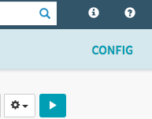
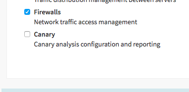
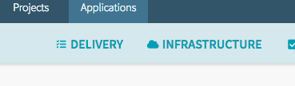

# Canary in the Coal Mine

This demonstrates how to use Spinnaker's new Automated Canary Analysis Service. 
You can read about it [here](https://medium.com/netflix-techblog/automated-canary-analysis-at-netflix-with-kayenta-3260bc7acc69) and [here](https://cloud.google.com/blog/products/gcp/introducing-kayenta-an-open-automated-canary-analysis-tool-from-google-and-netflix).

It is recommended that you read this entire document before proceding

## Setup Procedure

- This depends on the *HelloAgain* app from previous pipeline steps. Make sure you have completed the previous pipeline exercices. 
- This pipeline assumes previous trigger work and deployments where executed. 

### Disable previous "prod" pipeline

The canary pipeline will replace the existing prod pipeline. First, run the production pipeline and make sure that app deploys successfully. You can disable/delete this pipeline. 

### Enable Canary for you app

By defaults, "apps" in Spinnaker are not canary enabled you will need to enable it. 
To enable the canary feature go the `helloagain` app

Click on Config:

Scroll down to the features section and click check the canary box:

This will enable the *Delivery* options. It is recommended that you refresh the browser to get this new top level menu item as shown below:

### Deploy Canary Pipeline

As with previous pipeline deployment, access the *tunnel instance* and navigate to gcp pipeline folder for canary. Once there execute the following command  

`spin pipeline save --file=canary_prod.json`

This will deploy the canary pipeline for the `helloagain` app but the pipeline will not be executable.

#### Create Analysis Configuration for Canary

The canary step needs a Canary Configuration

--- image of canary step missing configuration ---

Let's create a canary configuration. 

#### Update Canary Setp in the Pipeline

## Run pipeline

This pipeline can take an hour to execute...because...the canary step is set to run for an hour. It is configured in `realtime` mode which requires enough real time to elapse for data capture. 

## Run it
 You can either manually run it or trigger the UAT pipeline. Explore the reports and metrics thate are displayed during/after pipeline execution

### Run it with some load

Since Canary is for *PRODUCTION* you need to create some load. Try using `Hey` that is located [here](https://github.com/rakyll/hey) (Why not run it in the google cloud shell?). Install `Hey` with:

`go get -u github.com/rakyll/hey`

Manually start the canary pipeline and run the following command with hey

`hey -c 50 -z 60m -m GET http://[IP ADDRESS OF Production LOAD BALANCER]/hello/somerandomstring` 

(Go take a break, this will be awhile, come back after lunch)

### Change the App

It is time to change the *HelloAgain* app. This requires that you have performed the steps in the previous exercise regarding pubsub.

we need to modify it to be "fatter". If you look [here](https://github.com/nparks-kenzan/hello-karyon-rxnetty-x/blob/feature/memoryhog/src/main/java/com/kenzan/karyon/rxnetty/endpoint/HelloEndpoint.java) you will see that we are making invocations to the primary endpoint larger when someone hits the hello endpoint and pass a string. Commit your changes to your fork. IF you need the previous exercises corretly, the `dev` pipeline will run followed by `uat` followed by the new `prod` featuring canary. 

Of course, when `prod` starts also start hey with
`hey -c 50 -z 60m -m GET http://[IP ADDRESS OF Production LOAD BALANCER]/hello/somerandomstring` 
 
You can use the GKE Dashboard to see load on the workload affect on the app. You can also use StackDriver.

## ... Next

1. Did the last Canary Pass/Fail?
1. Did the code change impact the app at all?
1. How would you change the Canary Pipeline?
1. Can You change the Canary Config to force a failure/success of the canary step?

Decompose all the pipeline steps and their implications.
1. What pipeline paths not covered?
1. What errors not accounted for?

In this exercises we used "Memory Usage" as a metric because it is *built in* and maybe (just maybe) if your changes do not alter functionality your app should not get bigger(?!?). However, you should consider items like error rates and latency among others. How would you intrument your environment (if you need to) to gather those metrics?