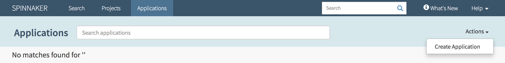
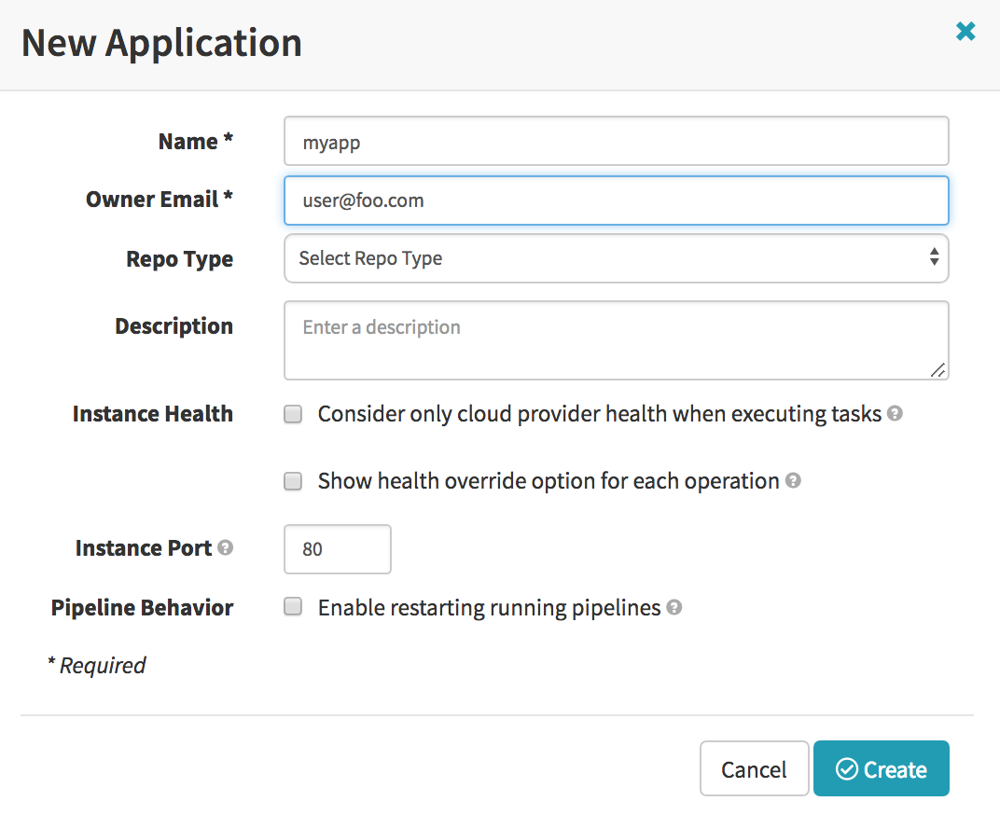
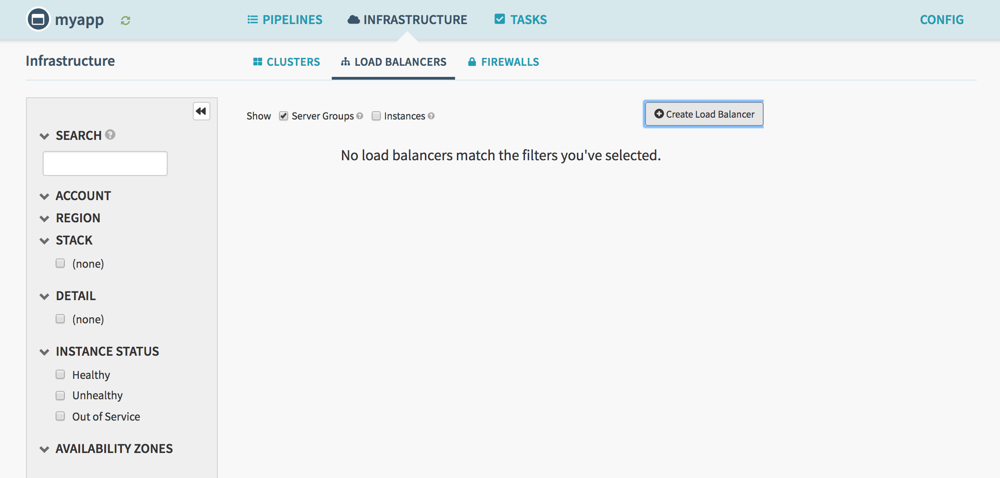
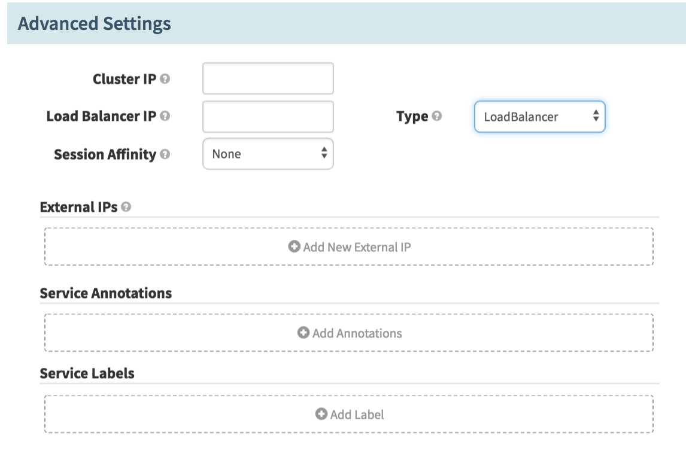
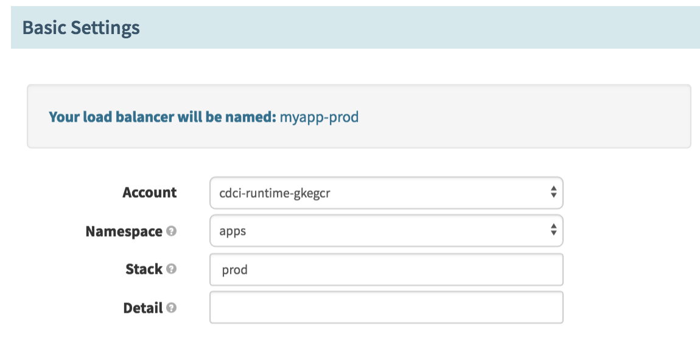
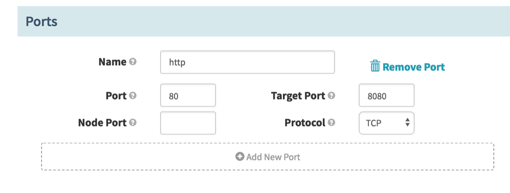
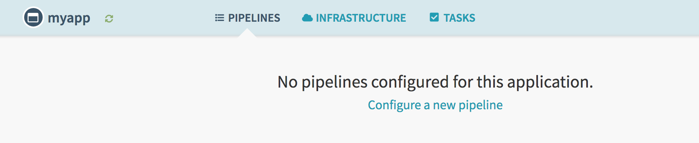
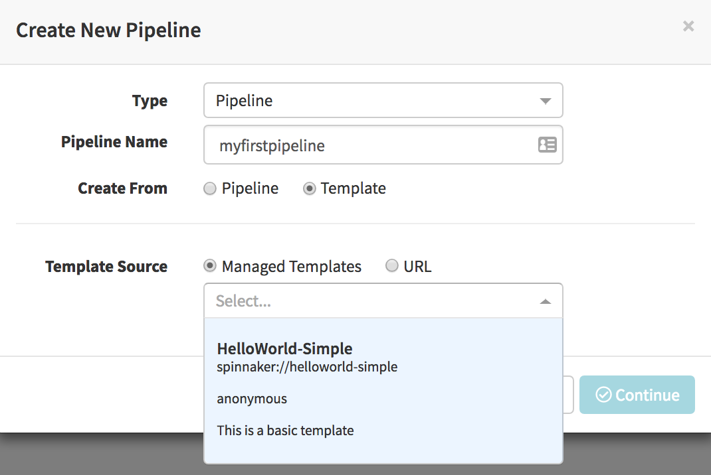

# Simple hello world pipeline

Here is a high level overview of this template:

1. Pull docker image
1. Deploy to K8s Cluster (Stage)
1. Get last deployed image
1. Deploy red/black to K8s Cluster (Prod)

Docker Image
- https://hub.docker.com/r/nparkskenzan/hellokenzan/

## Prerequisites

Make sure to publish the template via the tools instance with:
```bash
$ roer pipeline-template publish ./path/to/template.yml
```

Navigate to Spinnaker in a browser (`localhost:9000`)

#### Application

We will need to create a new Application in Spinnaker to create our Pipeline for it.

Start by creating a load balancer for `stage`.



Do not worry about `Repo Type` for now.




#### Load Balancers

We need to create two load balancers, one for each of our clusters (stage/prod).



Change the following fields:

- Namespace = apps
- Stack = stage


- Target Port = 8080


- Type = LoadBalancer



Create a second load balancer for `prod`.

Change the following fields:

- Namespace = apps
- Stack = stage



- Target Port = 8080



- Type = LoadBalancer


## Creating the Pipeline

Now that we have our load balancers set up for our application we can create the pipeline.

Configure a new pipeline.



- Create From = Templates
- Template Source = Managed Templates




Select the HelloWorld-Simple template

A window should appear with default values populated for the variables in our Pipeline Template.

Since we named our Application `myapp` and named our Stacks `stage` and `prod`, none of the fields need to change.

Variable Name | Default Value | Description
------------- | ------------- | -----------
k8sAccount | cdci-runtime-gkegcr | K8s account for application
k8sAppNamespace | apps | Namespace to be used for deploying application into K8s
appName | myapp | Name of application
stageLoadBalancer | myapp-stage | Application load balancer for `stage` stack
prodLoadBalancer | myapp-prod | Application load balancer for `prod` stack
k8sClusterStage | myapp-stage | K8s cluster for `stage` stack
k8sClusterProd | myapp-prod | K8s cluster for `prod` stack

- Hit "Configure"

- Hit "Save Changes"

The first time you run the pipeline it will automatically create the K8s clusters
`myapp-stage` and `myapp-prod`.

Enjoy!
